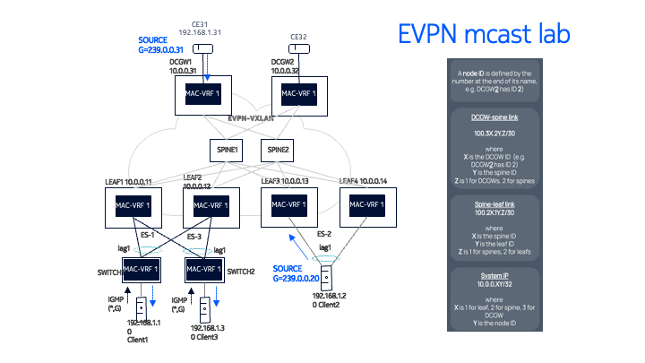

# EVPN Multicast interoperability between SR Linux and SROS
Ethernet VPN (EVPN) proposes a unified model for VPNs and cloud-based services, by providing a control plane framework that can deliver any type of VPN services. EVPN can also provide multicast services. In particular, this lab illustrates how RFC9251 IGMP/MLD proxy on EVPN networks is implemented in SR Linux and SROS.  

A Clos fabric, traditional architecture for data centers, will be deployed, as represented below. It includes a fabric made of four SR Linux routers, along with two 7750 SR-1 routers acting as Data Center Gateways, connected to CE routers that can send and receive IP multicast.



## Deploying the lab
The lab is deployed with [containerlab](https://containerlab.dev) project where [`nokia-evpn-mcast.clab.yml`](nokia-evpn-mcast.clab.yml) file declaratively describes the lab topology.

```bash
# deploy the lab
containerlab deploy 
```

Once the lab is completed, it can be removed with the destroy command.

```bash
# destroy the lab
containerlab destroy 
```

## Accessing the network elements
After deploying the lab, the nodes will be accessible. To access a network element, simply use its hostname as described in the table displayed after execution of the deploy command.
```
ssh admin@clab-evpn-mcast-leaf1
ssh admin@clab-evpn-mcast-dcgw1
```
The Linux CE clients don't have SSH enabled. In order to access them, use `docker exec`.
```
docker exec -it clab-evpn-mcast-client1 bash
```

## Configuration
All nodes come preconfigured thanks to startup-config setting in the topology file [`nokia-evpn-mcast.clab.yml`](nokia-evpn-mcast.clab.yml). Those configuration files can be found in [`configs`](/configs). 

### Underlay
eBGP is used to provide underlay connectivity between the routers. The routes exchanged over those BGP sessions can be seen by executing the commands below.

#### Leaf 1 (SR Linux)
<pre>
--{ + candidate shared default }--[  ]--
A:leaf1# show network-instance default protocols bgp routes ipv4 summary
----------------------------------------------------------------------------------------------------------------------------
Show report for the BGP route table of network-instance "default"
----------------------------------------------------------------------------------------------------------------------------
Status codes: u=used, *=valid, >=best, x=stale
Origin codes: i=IGP, e=EGP, ?=incomplete
----------------------------------------------------------------------------------------------------------------------------
+-----+--------------+--------------------+-----+-----+---------------------------------------+
| Sta |   Network    |      Next Hop      | MED | Loc |               Path Val                |
| tus |              |                    |     | Pre |                                       |
|     |              |                    |     |  f  |                                       |
+=====+==============+====================+=====+=====+=======================================+
| u*> | 10.0.0.11/32 | 0.0.0.0            | -   | 100 |  i                                    |
| u*> | 10.0.0.12/32 | 100.21.11.1        | -   | 100 | [65020, 65012] i                      |
| *   | 10.0.0.12/32 | 100.22.11.1        | -   | 100 | [65020, 65012] i                      |
| u*> | 10.0.0.13/32 | 100.21.11.1        | -   | 100 | [65020, 65013] i                      |
| *   | 10.0.0.13/32 | 100.22.11.1        | -   | 100 | [65020, 65013] i                      |
| u*> | 10.0.0.14/32 | 100.21.11.1        | -   | 100 | [65020, 65014] i                      |
| *   | 10.0.0.14/32 | 100.22.11.1        | -   | 100 | [65020, 65014] i                      |
| u*> | 10.0.0.21/32 | 100.21.11.1        | -   | 100 | [65020] i                             |
| u*> | 10.0.0.22/32 | 100.22.11.1        | -   | 100 | [65020] i                             |
| u*> | 10.0.0.31/32 | 100.21.11.1        | -   | 100 | [65020, 65030] i                      |
| *   | 10.0.0.31/32 | 100.22.11.1        | -   | 100 | [65020, 65030] i                      |
| u*> | 10.0.0.32/32 | 100.21.11.1        | -   | 100 | [65020, 65030] i                      |
| *   | 10.0.0.32/32 | 100.22.11.1        | -   | 100 | [65020, 65030] i                      |
| u*> | 100.21.11.0/ | 0.0.0.0            | -   | 100 |  i                                    |
|     | 30           |                    |     |     |                                       |
| u*> | 100.22.11.0/ | 0.0.0.0            | -   | 100 |  i                                    |
|     | 30           |                    |     |     |                                       |
+-----+--------------+--------------------+-----+-----+---------------------------------------+
----------------------------------------------------------------------------------------------------------------------------
15 received BGP routes: 10 used, 15 valid, 0 stale
10 available destinations: 5 with ECMP multipaths
----------------------------------------------------------------------------------------------------------------------------
--{ + candidate shared default }--[  ]--
</pre>

#### DCGW 1 (SROS)
<pre>
A:admin@dcgw1# show router bgp routes ipv4 brief
===============================================================================
 BGP Router ID:10.0.0.31        AS:65030       Local AS:65030
===============================================================================
 Legend -
 Status codes  : u - used, s - suppressed, h - history, d - decayed, * - valid
                 l - leaked, x - stale, > - best, b - backup, p - purge
 Origin codes  : i - IGP, e - EGP, ? - incomplete

===============================================================================
BGP IPv4 Routes
===============================================================================
Flag  Network
-------------------------------------------------------------------------------
u*>i  10.0.0.11/32
*i    10.0.0.11/32
u*>i  10.0.0.12/32
*i    10.0.0.12/32
u*>i  10.0.0.13/32
*i    10.0.0.13/32
u*>i  10.0.0.14/32
*i    10.0.0.14/32
u*>i  10.0.0.21/32
u*>i  10.0.0.22/32
u*>i  10.0.0.32/32
*i    10.0.0.32/32
-------------------------------------------------------------------------------
Routes : 12
===============================================================================
</pre>


### Overlay
MP-BGP is used to provide overlay connectivity between the routers, and to therefore exchange EVPN routes. A Layer-2 service is defined on the leafs, it gives access to two multi-homed nodes. Multi-homing with EVPN requires the advertisement of Ethernet Auto-Discovery routes between leafs and up to the DCGWs. Those routes can be seen with the commands provided below.

#### Leaf 1 (SR Linux)
<pre>
--{ + candidate shared default }--[  ]--
A:leaf1# /show network-instance default protocols bgp routes evpn route-type 1 summary
----------------------------------------------------------------------------------------------------------------------------
Show report for the BGP route table of network-instance "default"
----------------------------------------------------------------------------------------------------------------------------
Status codes: u=used, *=valid, >=best, x=stale
Origin codes: i=IGP, e=EGP, ?=incomplete
----------------------------------------------------------------------------------------------------------------------------
BGP Router ID: 10.0.0.11      AS: 65011      Local AS: 65011
----------------------------------------------------------------------------------------------------------------------------
----------------------------------------------------------------------------------------------------------------------------
Type 1 Ethernet Auto-Discovery Routes
+--------+----------------+--------------------------------+------------+----------------+----------------+----------------+
| Status |     Route-     |              ESI               |   Tag-ID   |    neighbor    |    Next-hop    |     Label      |
|        | distinguisher  |                                |            |                |                |                |
+========+================+================================+============+================+================+================+
| u*>    | 1:12           | 01:01:01:01:01:01:01:01:01:01  | 0          | 10.0.0.21      | 10.0.0.12      | -              |
| *      | 1:12           | 01:01:01:01:01:01:01:01:01:01  | 0          | 10.0.0.22      | 10.0.0.12      | -              |
| u*>    | 1:12           | 01:01:01:01:01:01:01:01:01:01  | 4294967295 | 10.0.0.21      | 10.0.0.12      | -              |
| *      | 1:12           | 01:01:01:01:01:01:01:01:01:01  | 4294967295 | 10.0.0.22      | 10.0.0.12      | -              |
| u*>    | 1:12           | 03:03:03:03:03:03:03:03:03:03  | 0          | 10.0.0.21      | 10.0.0.12      | -              |
| *      | 1:12           | 03:03:03:03:03:03:03:03:03:03  | 0          | 10.0.0.22      | 10.0.0.12      | -              |
| u*>    | 1:12           | 03:03:03:03:03:03:03:03:03:03  | 4294967295 | 10.0.0.21      | 10.0.0.12      | -              |
| *      | 1:12           | 03:03:03:03:03:03:03:03:03:03  | 4294967295 | 10.0.0.22      | 10.0.0.12      | -              |
| u*>    | 1:13           | 02:02:02:02:02:02:02:02:02:02  | 0          | 10.0.0.21      | 10.0.0.13      | -              |
| *      | 1:13           | 02:02:02:02:02:02:02:02:02:02  | 0          | 10.0.0.22      | 10.0.0.13      | -              |
| u*>    | 1:13           | 02:02:02:02:02:02:02:02:02:02  | 4294967295 | 10.0.0.21      | 10.0.0.13      | -              |
| *      | 1:13           | 02:02:02:02:02:02:02:02:02:02  | 4294967295 | 10.0.0.22      | 10.0.0.13      | -              |
| u*>    | 1:14           | 02:02:02:02:02:02:02:02:02:02  | 0          | 10.0.0.21      | 10.0.0.14      | -              |
| *      | 1:14           | 02:02:02:02:02:02:02:02:02:02  | 0          | 10.0.0.22      | 10.0.0.14      | -              |
| u*>    | 1:14           | 02:02:02:02:02:02:02:02:02:02  | 4294967295 | 10.0.0.21      | 10.0.0.14      | -              |
| *      | 1:14           | 02:02:02:02:02:02:02:02:02:02  | 4294967295 | 10.0.0.22      | 10.0.0.14      | -              |
+--------+----------------+--------------------------------+------------+----------------+----------------+----------------+
16 Ethernet Auto-Discovery routes 8 used, 16 valid
----------------------------------------------------------------------------------------------------------------------------
--{ + candidate shared default }--[  ]--
</pre>

#### DCGW 1 (SROS)
<pre>
[/]
A:admin@dcgw1# show router bgp routes evpn auto-disc
===============================================================================
 BGP Router ID:10.0.0.31        AS:65030       Local AS:65030
===============================================================================
 Legend -
 Status codes  : u - used, s - suppressed, h - history, d - decayed, * - valid
                 l - leaked, x - stale, > - best, b - backup, p - purge
 Origin codes  : i - IGP, e - EGP, ? - incomplete

===============================================================================
BGP EVPN Auto-Disc Routes
===============================================================================
Flag  Route Dist.         ESI                           NextHop
      Tag                                               Label
-------------------------------------------------------------------------------
u*>i  1:11                01:01:01:01:01:01:01:01:01:01 10.0.0.11
      0                                                 VNI 1

*i    1:11                01:01:01:01:01:01:01:01:01:01 10.0.0.11
      0                                                 VNI 1

u*>i  1:11                01:01:01:01:01:01:01:01:01:01 10.0.0.11
      MAX-ET                                            VNI 0

*i    1:11                01:01:01:01:01:01:01:01:01:01 10.0.0.11
      MAX-ET                                            VNI 0

u*>i  1:11                03:03:03:03:03:03:03:03:03:03 10.0.0.11
      0                                                 VNI 1

*i    1:11                03:03:03:03:03:03:03:03:03:03 10.0.0.11
      0                                                 VNI 1

u*>i  1:11                03:03:03:03:03:03:03:03:03:03 10.0.0.11
      MAX-ET                                            VNI 0

*i    1:11                03:03:03:03:03:03:03:03:03:03 10.0.0.11
      MAX-ET                                            VNI 0

u*>i  1:12                01:01:01:01:01:01:01:01:01:01 10.0.0.12
      0                                                 VNI 1

*i    1:12                01:01:01:01:01:01:01:01:01:01 10.0.0.12
      0                                                 VNI 1

u*>i  1:12                01:01:01:01:01:01:01:01:01:01 10.0.0.12
      MAX-ET                                            VNI 0

*i    1:12                01:01:01:01:01:01:01:01:01:01 10.0.0.12
      MAX-ET                                            VNI 0

u*>i  1:12                03:03:03:03:03:03:03:03:03:03 10.0.0.12
      0                                                 VNI 1

*i    1:12                03:03:03:03:03:03:03:03:03:03 10.0.0.12
      0                                                 VNI 1

u*>i  1:12                03:03:03:03:03:03:03:03:03:03 10.0.0.12
      MAX-ET                                            VNI 0

*i    1:12                03:03:03:03:03:03:03:03:03:03 10.0.0.12
      MAX-ET                                            VNI 0

u*>i  1:13                02:02:02:02:02:02:02:02:02:02 10.0.0.13
      0                                                 VNI 1

*i    1:13                02:02:02:02:02:02:02:02:02:02 10.0.0.13
      0                                                 VNI 1

u*>i  1:13                02:02:02:02:02:02:02:02:02:02 10.0.0.13
      MAX-ET                                            VNI 0

*i    1:13                02:02:02:02:02:02:02:02:02:02 10.0.0.13
      MAX-ET                                            VNI 0

u*>i  1:14                02:02:02:02:02:02:02:02:02:02 10.0.0.14
      0                                                 VNI 1

*i    1:14                02:02:02:02:02:02:02:02:02:02 10.0.0.14
      0                                                 VNI 1

u*>i  1:14                02:02:02:02:02:02:02:02:02:02 10.0.0.14
      MAX-ET                                            VNI 0

*i    1:14                02:02:02:02:02:02:02:02:02:02 10.0.0.14
      MAX-ET                                            VNI 0

-------------------------------------------------------------------------------
Routes : 24
===============================================================================

[/]
</pre>


### Advertising a MAC-IP route in the fabric
On both DCGWs, a VPLS is defined and is connected to a VPRN instance via PXC ports. With an interface on both DCGWs, we can use the CEs to send traffic through the fabric. This will therefore create an EVPN MAC/IP Advertisement route containing the MAC address of both clients.  

To send traffic from one of the clients, connect to one of those and execute the following command.

```bash
ping 192.168.1.31
```

After execution, the MAC/IP route related to the client should be displayed, containing the MAC address along with the Ethernet Segment Identifier.

<pre>
A:admin@dcgw1# show router bgp routes evpn mac
===============================================================================
 BGP Router ID:10.0.0.31        AS:65030       Local AS:65030
===============================================================================
 Legend -
 Status codes  : u - used, s - suppressed, h - history, d - decayed, * - valid
                 l - leaked, x - stale, > - best, b - backup, p - purge
 Origin codes  : i - IGP, e - EGP, ? - incomplete

===============================================================================
BGP EVPN MAC Routes
===============================================================================
Flag  Route Dist.         MacAddr           ESI
      Tag                 Mac Mobility      Label1
                          Ip Address
                          NextHop
-------------------------------------------------------------------------------
u*>i  1:11                1a:61:0c:ff:00:00 03:03:03:03:03:03:03:03:03:03
      0                   Seq:0             VNI 1
                          n/a
                          10.0.0.11

*i    1:11                1a:61:0c:ff:00:00 03:03:03:03:03:03:03:03:03:03
      0                   Seq:0             VNI 1
                          n/a
                          10.0.0.11

u*>i  1:11                1a:9a:0b:ff:00:00 01:01:01:01:01:01:01:01:01:01
      0                   Seq:0             VNI 1
                          n/a
                          10.0.0.11

*i    1:11                1a:9a:0b:ff:00:00 01:01:01:01:01:01:01:01:01:01
      0                   Seq:0             VNI 1
                          n/a
                          10.0.0.11

u*>i  1:12                aa:c1:ab:b8:f2:7f 01:01:01:01:01:01:01:01:01:01
      0                   Seq:0             VNI 1
                          n/a
                          10.0.0.12

*i    1:12                aa:c1:ab:b8:f2:7f 01:01:01:01:01:01:01:01:01:01
      0                   Seq:0             VNI 1
                          n/a
                          10.0.0.12

-------------------------------------------------------------------------------
Routes : 6
===============================================================================
</pre>

## IP Multicast Considerations

The four Leaf nodes (7220 D2) and the two DCGW nodes (7750 SR-1) are attached to the same EVPN Broadcast Domain that is configured with the EVPN proxy functionality as per RFC9251, on SRLinux and SROS systems. 

Where:

- DCGW1 and DCGW2 are two 7750 SR systems, configured with a VPLS service that has evpn-proxy enabled.
- LEAF1..LEAF4 are four SRLinux 7220 D2 nodes. 
      - LEAF3 and LEAF4 are multi-homed to Client2, a linux container that generates traffic for group 239.0.0.20. 
- The four Leaf nodes and the two DCGW nodes are attached to the same EVPN broadcast domain.
- SWITCH1 and SWITCH2 are two SRLinux 7220 D2 systems are not EVPN enabled, but have igmp-snooping enable so that they can generate IGMP reports on behalf of the Clients. 
      - The two switches are dual-homed to LEAF1 and LEAF2, using all-active Ethernet Segments.

The relevant multicast configurations follow.

### DCGW1 configuration (DCGW2 is equivalent)

<pre>
// BGP config
 
[ex:/configure router "Base" bgp]
A:admin@dcgw1# info
    admin-state enable
    loop-detect off
    min-route-advertisement 1
    rapid-withdrawal true
    ebgp-default-reject-policy {
        import false
        export false
    }
    rapid-update {
        evpn true
    }
    group "overlay" {
        peer-as 65555
        family {
            evpn true
        }
        local-as {
            as-number 65555
        }
    }
    group "underlay" {
        family {
            ipv4 true
        }
        export {
            policy ["system_ip"]
        }
    }
    neighbor "10.0.0.21" {
        group "overlay"
    }
    neighbor "10.0.0.22" {
        group "overlay"
    }
    neighbor "100.31.21.2" {
        group "underlay"
        peer-as 65020
    }
    neighbor "100.31.22.2" {
        group "underlay"
        peer-as 65020
    }
 
[ex:/configure router "Base" bgp]
A:admin@dcgw1# /configure service vpls 1
 
// MAC-VRF 1 configuration in DCGW1
 
[ex:/configure service vpls "1"]
A:admin@dcgw1# info
    admin-state enable
    service-id 1
    customer "1"
    vxlan {
        instance 1 {
            vni 1
        }
    }
    bgp 1 {
        route-distinguisher "1:31"
        route-target {
            export "target:65011:1"
            import "target:65011:1"
        }
    }
    igmp-snooping {
        admin-state enable // igmp-snooping and evpn-proxy are enabled!
        evpn-proxy {
            admin-state enable
        }
    }
    mld-snooping {
        admin-state enable
        evpn-proxy {
            admin-state enable
        }
    }
    bgp-evpn {
        evi 1
        routes {
            sel-mcast {
                advertise true // the advertisement of SMET routes is enabled!
            }
        }
        vxlan 1 {
            admin-state enable
            vxlan-instance 1
            ecmp 8
            routes {
                auto-disc {
                    advertise true
                }
            }
        }
    }
    sap pxc-1.a:1 {
        igmp-snooping {
            static {
                group 239.0.0.20 { // a static group is configured to attract the mcast traffic from Client2
                    starg
                }
            }
        }
    }
 
[ex:/configure service vpls "1"]
A:admin@dcgw1# /configure service vprn 10
 
// VPRN 10 represents CE31 and will be sourcing multicast traffic to group 239.0.0.31
 
[ex:/configure service vprn "10"]
A:admin@dcgw1# info
    admin-state enable
    description "CE31"
    customer "1"
    autonomous-system 100
    interface "vpls-1" {
        ipv4 {
            primary {
                address 192.168.1.31
                prefix-length 24
            }
        }
        sap pxc-1.b:1 {
        }
    }
</pre>

### LEAF1 configuration (the other Leaf nodes have equivalent configurations)

<pre>
--{ candidate shared default }--[ network-instance default ]--
A:leaf1# info
    type default
    interface ethernet-1/51.0 {
    }
    interface ethernet-1/52.0 {
    }
    interface system0.0 {
    }
    protocols {
        bgp {
            autonomous-system 65011
            router-id 10.0.0.11
            ebgp-default-policy {
                import-reject-all false
                export-reject-all false
            }
            afi-safi ipv4-unicast {
                admin-state enable
            }
            trace-options {
                flag update {
                    modifier detail
                }
            }
            group overlay {
                peer-as 65555
                afi-safi evpn {
                    admin-state enable
                }
                afi-safi ipv4-unicast {
                    admin-state disable
                }
                local-as {
                    as-number 65555
                }
                timers {
                    connect-retry 1
                    minimum-advertisement-interval 1
                }
                transport {
                    local-address 10.0.0.11
                }
            }
            group underlay {
                export-policy system_ip
                afi-safi ipv4-unicast {
                    admin-state enable
                }
                timers {
                    connect-retry 1
                    minimum-advertisement-interval 1
                }
            }
            neighbor 10.0.0.21 {
                peer-group overlay
            }
            neighbor 10.0.0.22 {
                peer-group overlay
            }
            neighbor 100.21.11.1 {
                peer-as 65020
                peer-group underlay
            }
            neighbor 100.22.11.1 {
                peer-as 65020
                peer-group underlay
            }
        }
    }
--{ candidate shared default }--[ network-instance default ]--
A:leaf1# /network-instance "MAC-VRF 1"
--{ candidate shared default }--[ network-instance "MAC-VRF 1" ]--
A:leaf1# info
    type mac-vrf
    interface ethernet-1/1.1 {
    }
    interface ethernet-1/2.1 {
    }
    vxlan-interface vxlan0.1 {
    }
    protocols {
        bgp-evpn {
            bgp-instance 1 {
                admin-state enable
                vxlan-interface vxlan0.1
                evi 1
                ecmp 2
            }
        }
        bgp-vpn {
            bgp-instance 1 {
                route-distinguisher {
                    rd 1:11
                }
                route-target {
                    export-rt target:65011:1
                    import-rt target:65011:1
                }
            }
        }
        igmp-snooping {  // this is the configuration required for EVPN multicast or evpn-proxy in SRL
            admin-state enable
            trace-options {
                trace {
                    packet {
                        modifier egress-ingress-and-dropped
                    }
                }
            }
            interface ethernet-1/1.1 {
                version 2
                send-queries true // queries are generated locally since queries are not propagated in EVPN
            }
            interface ethernet-1/2.1 {
                version 2
                send-queries true
            }
        }
    }
A:leaf1# /system network-instance
--{ candidate shared default }--[ system network-instance ]--
A:leaf1# info
    protocols {
        evpn {
            ethernet-segments {
                bgp-instance 1 {
                    ethernet-segment ES-SROS-Client1 {
                        admin-state enable
                        esi 01:01:01:01:01:01:01:01:01:01
                        multi-homing-mode all-active
                        interface ethernet-1/1 {
                        }
                    }
                    ethernet-segment ES-SROS-Client3 {
                        admin-state enable
                        esi 03:03:03:03:03:03:03:03:03:03
                        multi-homing-mode all-active
                        interface ethernet-1/2 {
                        }
                    }
                }
            }
        }
        bgp-vpn {
            bgp-instance 1 {
            }
        }
    }
</pre>

### Configuration on SWITCH1 (configuration on SWITCH2 is equivalent)

<pre>
--{ candidate shared default }--[ network-instance "MAC-VRF 1" ]--
A:switch1# info
    type mac-vrf
    interface ethernet-1/1.1 {
    }
    interface lag1.1 {
    }
    protocols {
        igmp-snooping {
            admin-state enable
            trace-options {
                trace {
                    packet {
                        modifier egress-ingress-and-dropped
                    }
                }
            }
            interface ethernet-1/1.1 {
                static-membership-groups { // two static groups are configured to emulate the joins sent by the clients
                    group 239.0.0.20 {
                        starg
                    }
                    group 239.0.0.31 {
                        source 192.168.1.31 {
                        }
                    }
                }
            }
            interface lag1.1 {
            }
        }
    }
</pre>

### How to test multicast

Based on the above configuration we test sending multicast traffic from Client2 and we check that it is received in e.g., Client1 and Client3. The traffic is delivered as expected only to those interfaces where there are interested receivers. 

---
**Note** 

Multicast can be generated with a ping from the SROS VPRN emulating the CEs:
```bash
ping router-instance "10" 239.0.0.31 interface "vpls-1" count 9999 rapid
```
On the Linux clients, nping can be used to generate IP multicast. This requires the instalation of nping as follows.
```bash
bash-5.0#
bash-5.0# apk add nmap-nping
fetch http://dl-cdn.alpinelinux.org/alpine/v3.12/main/x86_64/APKINDEX.tar.gz
fetch http://dl-cdn.alpinelinux.org/alpine/v3.12/community/x86_64/APKINDEX.tar.gz
(1/1) Installing nmap-nping (7.80-r2)
Executing busybox-1.31.1-r16.trigger
OK: 213 MiB in 114 packages
```
Once nping is installed, this is an example about how to generate IP multicast traffic to group 239.0.0.20:
```bash
nping --udp 239.0.0.20 --source-ip 192.168.1.20 --source-port 12345 --dest-port 12345 --interface bond0.1 -d5 -c 1000 --dest-mac 01:00:5e:00:00:02
```
---

As an example, when multicast is generated from Client2, 192.168.1.20, to group 239.0.0.20. Nping is used on the alpine linux client.

<pre> 
bash-5.0# nping --udp 239.0.0.20 --source-ip 192.168.1.20 --source-port 12345 --dest-port 12345 --interface bond0.1 -d5 -c 1000 --dest-mac 01:00:5e:00:00:02
Using network interface "bond0.1"
Nping will send packets at raw ethernet level
 
Starting Nping 0.7.80 ( https://nmap.org/nping ) at 2024-01-15 08:56 UTC
Resolving specified targets...
Determining target 239.0.0.20 MAC address or next hop MAC address...
    > Checking system's ARP cache...
    > No relevant entries found in system's ARP cache.
    > Sending ARP request using spoofed IP 192.168.1.20...
    > No ARP responses received.
    > Sending ARP request using our real IP 192.168.1.20...
    > No ARP responses received
+-----------------TARGET-----------------+
Device Name:            bond0.1
Device FullName:        bond0.1
Device Type:            Ethernet
Directly connected?:    yes
Address family:         AF_INET
Resolved Hostname:
Supplied Hostname:      (null)
Target Address:         239.0.0.20
Source Address:         192.168.1.20
Spoofed Address:        192.168.1.20
Next Hop Address:       239.0.0.20
Target MAC Address:     00:00:00:00:00:00
Source MAC Address:     aa:c1:ab:72:72:04
Next Hop MAC Address:   00:00:00:00:00:00
1 target IP address determined.
...
 </pre>
 
Traffic is received in Client1 and Client3:
 
<pre>
Client1# tcpdump --imme -len -i eth1.1. // same for Client3
tcpdump: verbose output suppressed, use -v or -vv for full protocol decode
listening on eth1.1, link-type EN10MB (Ethernet), capture size 262144 bytes
08:17:55.656355 1a:f2:06:ff:00:00 > 01:00:5e:00:00:01, ethertype IPv4 (0x0800), length 60: 10.0.0.12 > 224.0.0.1: igmp query v2
 
08:20:00.594825 1a:f2:06:ff:00:00 > 01:00:5e:00:00:01, ethertype IPv4 (0x0800), length 60: 10.0.0.12 > 224.0.0.1: igmp query v2
08:22:00.946117 aa:c1:ab:78:72:04 > 01:00:5e:00:00:02, ethertype IPv4 (0x0800), length 60: 192.168.1.20.12345 > 239.0.0.20.12345: UDP, length 0
08:22:01.946102 aa:c1:ab:78:72:04 > 01:00:5e:00:00:02, ethertype IPv4 (0x0800), length 60: 192.168.1.20.12345 > 239.0.0.20.12345: UDP, length 0
08:22:02.947162 aa:c1:ab:78:72:04 > 01:00:5e:00:00:02, ethertype IPv4 (0x0800), length 60: 192.168.1.20.12345 > 239.0.0.20.12345: UDP, length 0
08:22:03.948531 aa:c1:ab:78:72:04 > 01:00:5e:00:00:02, ethertype IPv4 (0x0800), length 60: 192.168.1.20.12345 > 239.0.0.20.12345: UDP, length 0
08:22:04.950427 aa:c1:ab:78:72:04 > 01:00:5e:00:00:02, ethertype IPv4 (0x0800), length 60: 192.168.1.20.12345 > 239.0.0.20.12345: UDP, length 0
08:22:05.634057 1a:f2:06:ff:00:00 > 01:00:5e:00:00:01, ethertype IPv4 (0x0800), length 60: 10.0.0.12 > 224.0.0.1: igmp query v2
08:22:05.951174 aa:c1:ab:78:72:04 > 01:00:5e:00:00:02, ethertype IPv4 (0x0800), length 60: 192.168.1.20.12345 > 239.0.0.20.12345: UDP, length 0
</pre>
 
Switch1 receives the multicast from LEAF2, since LEAF2 is the DF:
 
<pre>
Every 2.0s: / info from state interface ethernet-1/52 statistics                                                              (Executions 7, Mon 08:25:53AM)
 
    interface ethernet-1/52 {
        statistics {
            in-packets 7482
            in-octets 627360
            in-unicast-packets 25
            in-broadcast-packets 40
            in-multicast-packets 7417 <--
            in-discarded-packets 0
            in-error-packets 0
            in-fcs-error-packets 0
            out-packets 172
            out-octets 13302
            out-mirror-octets 0
            out-unicast-packets 9
            out-broadcast-packets 0
            out-multicast-packets 163
            out-discarded-packets 0
            out-error-packets 0
            out-mirror-packets 0
            carrier-transitions 1
        }
    }
 
--{ candidate shared default }--[  ]--
A:leaf1# show system network-instance ethernet-segments
------------------------------------------------------------------------------------------------------------------------------------------------------------------------------------------------------------------------------------
ES-SROS-Client1 is up, all-active
  ESI      : 01:01:01:01:01:01:01:01:01:01
  Alg      : default
  Peers    : 10.0.0.12
  Interface: ethernet-1/1
  Next-hop : N/A
  evi      : N/A
  Network-instances:
     MAC-VRF 1
      Candidates : 10.0.0.11, 10.0.0.12 (DF)
      Interface : ethernet-1/1.1
------------------------------------------------------------------------------------------------------------------------------------------------------------------------------------------------------------------------------------
ES-SROS-Client3 is up, all-active
  ESI      : 03:03:03:03:03:03:03:03:03:03
  Alg      : default
  Peers    : 10.0.0.12
  Interface: ethernet-1/2
  Next-hop : N/A
  evi      : N/A
  Network-instances:
     MAC-VRF 1
      Candidates : 10.0.0.11, 10.0.0.12 (DF)
      Interface : ethernet-1/2.1
------------------------------------------------------------------------------------------------------------------------------------------------------------------------------------------------------------------------------------
Summary
 2 Ethernet Segments Up
 0 Ethernet Segments Down
------------------------------------------------------------------------------------------------------------------------------------------------------------------------------------------------------------------------------------
--{ candidate shared default }--[  ]--
</pre>
The following commands show the MFIBs in all the Leaf nodes and the DCGWs. For instance, LEAF3's MFIB has OIFs to LEAF1/2/DCGW1:
<pre> 
--{ candidate shared default }--[  ]--
A:leaf3# info from state network-instance "MAC-VRF 1" multicast-forwarding-information-base multicast-route 0.0.0.0 group 239.0.0.20
    network-instance "MAC-VRF 1" {
        multicast-forwarding-information-base {
            multicast-route 0.0.0.0 group 239.0.0.20 {
                last-update "2024-01-11T02:52:39.241Z (4 days ago)"
                outgoing-next-hop-group 203145816567 {
                    forward true
                }
                outgoing-next-hop-group 203145816569 {
                    forward true
                }
                outgoing-next-hop-group 203145816575 {
                    forward true
                }
            }
        }
    }
 
--{ candidate shared default }--[  ]--
A:leaf3# show network-instance "MAC-VRF 1" protocols igmp-snooping vxlan-destination
================================================================================================================================================================
Net-Inst "MAC-VRF 1" IGMP SNOOPING vxlan destinations
================================================================================================================================================================
+-----------+-----+--------------+------------+---------------+--------+--------+
|   Vtep    | Vni |    NHG Id    | Is MRouter | Is Evpn Proxy | Is SBD | Groups |
+===========+=====+==============+============+===============+========+========+
| 10.0.0.11 | 1   | 203145816567 | false      | true          | false  | 2      |
| 10.0.0.12 | 1   | 203145816569 | false      | true          | false  | 2      |
| 10.0.0.14 | 1   | 203145816565 | false      | true          | false  | 0      |
| 10.0.0.31 | 1   | 203145816575 | false      | true          | false  | 1      |
| 10.0.0.32 | 1   | 203145816573 | false      | true          | false  | 0      |
+-----------+-----+--------------+------------+---------------+--------+--------+
----------------------------------------------------------------------------------------------------------------------------------------------------------------
No. of destinations: 5
================================================================================================================================================================
--{ candidate shared default }--[  ]--
</pre>
Whereas LEAF2, has OIFs to the local subinterfaces (for which LEAF2 is DF), and also to the LEAF1 and DCGW1 which also advertised SMETs
<pre> 
A:leaf2# info from state network-instance "MAC-VRF 1" multicast-forwarding-information-base multicast-route 0.0.0.0 group 239.0.0.20
    network-instance "MAC-VRF 1" {
        multicast-forwarding-information-base {
            multicast-route 0.0.0.0 group 239.0.0.20 {
                last-update "2024-01-11T02:52:39.230Z (4 days ago)"
                outgoing-interface 1 {
                    forward true
                }
                outgoing-interface 2 {
                    forward true
                }
                outgoing-next-hop-group 203145226466 {
                    forward true
                }
                outgoing-next-hop-group 203145226474 {
                    forward true
                }
            }
        }
    }
--{ candidate shared default }--[  ]--
A:leaf2# show network-instance "MAC-VRF 1" protocols igmp-snooping vxlan-destination
==================================================================================================================================================================================================================================
Net-Inst "MAC-VRF 1" IGMP SNOOPING vxlan destinations
==================================================================================================================================================================================================================================
+-----------+-----+--------------+------------+---------------+--------+--------+
|   Vtep    | Vni |    NHG Id    | Is MRouter | Is Evpn Proxy | Is SBD | Groups |
+===========+=====+==============+============+===============+========+========+
| 10.0.0.11 | 1   | 203145226466 | false      | true          | false  | 2      |
| 10.0.0.13 | 1   | 203145226469 | false      | true          | false  | 0      |
| 10.0.0.14 | 1   | 203145226464 | false      | true          | false  | 0      |
| 10.0.0.31 | 1   | 203145226474 | false      | true          | false  | 1      |
| 10.0.0.32 | 1   | 203145226472 | false      | true          | false  | 0      |
+-----------+-----+--------------+------------+---------------+--------+--------+
----------------------------------------------------------------------------------------------------------------------------------------------------------------------------------------------------------------------------------
No. of destinations: 5
==================================================================================================================================================================================================================================
--{ candidate shared default }--[  ]--
</pre> 
This is an example of state in LEAF1:
<pre> 
--{ candidate shared default }--[  ]--
A:leaf1# info from state network-instance "MAC-VRF 1" protocols igmp-snooping
    network-instance "MAC-VRF 1" {
        protocols {
            igmp-snooping {
                admin-state enable
                query-interval 125
                robust-count 2
                oper-state up
                transmitted-bgp-smet-routes 22
                proxy-membership-group-count 2
                proxy-evpn-membership-group-count 2
                trace-options {
                    trace {
                        packet {
                            modifier egress-ingress-and-dropped
                        }
                    }
                }
                proxy-membership-groups {  // --> proxy DB
                    group 239.0.0.20 {
                        filter-mode exclude
                        up-time "2024-01-11T02:52:38.000Z (4 days ago)"
                    }
                    group 239.0.0.31 {
                        filter-mode exclude
                        up-time "2024-01-11T02:52:39.000Z (4 days ago)"
                    }
                }
                proxy-evpn-membership-groups { // --> proxy-evpn DB used to propagate the reports with the proper flags
                    group 239.0.0.20 {
                        filter-mode exclude
                        up-time "2024-01-11T02:52:38.000Z (4 days ago)"
                        v1-support false
                        v2-support true
                        v3-support false
                    }
                    group 239.0.0.31 {
                        filter-mode exclude
                        up-time "2024-01-11T02:52:39.000Z (4 days ago)"
                        v1-support false
                        v2-support true
                        v3-support false
                    }
                }
                interface ethernet-1/1.1 {
                    router-alert-check true
                    version 2
                    maximum-number-groups 0
                    maximum-number-sources 0
                    maximum-number-group-sources 0
                    query-interval 125
                    query-last-member-interval 1
                    query-response-interval 10
                    robust-count 2
                    fast-leave false
                    mrouter-port false
                    send-queries true
                    membership-group-count 2
                    is-mrouter-port false
                    membership-groups {
                        group 239.0.0.20 {
                            group-type dynamic // --> type is dynamic because the report from SWITCH1 is hashed to LEAF1. On LEAF2, it shows as "group-type bgp-sync"
                            filter-mode exclude
                            expiry-time 245
                            up-time "2024-01-11T02:52:38.000Z (4 days ago)"
                            v1-host-timer 0
                            v2-host-timer 245
                            igmp-compatibility-mode 2
                        }
                        group 239.0.0.31 {
                            group-type dynamic
                            filter-mode exclude
                            expiry-time 242
                            up-time "2024-01-11T02:52:39.000Z (4 days ago)"
                            v1-host-timer 0
                            v2-host-timer 242
                            igmp-compatibility-mode 2
                        }
                    }
                    statistics {
                        received {
                            general-queries 0
                            group-queries 0
                            group-source-queries 0
                            v1-reports 0
                            v2-reports 5860
                            v3-reports 6
                            leave-messages 3
                            discarded-packets 2
                            bgp-join-sync 4
                            bgp-leave-sync 0
                        }
                        transmitted {
                            general-queries 2
                            group-queries 11
                            group-source-queries 0
                            v1-reports 0
                            v2-reports 0
                            v3-reports 0
                            leave-messages 0
                            error-packets 0
                            bgp-join-sync 6
                            bgp-leave-sync 6
                        }
                        forwarded {
                            general-queries 0
                            group-queries 0
                            group-source-queries 0
                            v1-reports 0
                            v2-reports 0
                            v3-reports 0
                            leave-messages 0
                            unknown-type 0
                            error-packets 0
                        }
                        error {
                            bad-length 0
                            unknown-type 0
                            wrong-version 0
                            missing-router-alert 0
                            bad-encoding 0
                            local-scope 0
                            reached-maximum-number-groups 0
                            reached-maximum-number-group-sources 0
                            reached-maximum-number-sources 0
                            out-of-memory-discarded-packets 0
                            bad-igmp-checksum 0
                            zero-source-ip-address 0
                            send-query-configured-discarded-packets 0
                            discarded-bgp-join-sync 0
                            discarded-bgp-leave-sync 0
                        }
                        multicast-states {
                            star-group-entries 2
                            source-group-entries 0
                        }
                    }
                }
                interface ethernet-1/2.1 {
                    router-alert-check true
                    version 2
                    maximum-number-groups 0
                    maximum-number-sources 0
                    maximum-number-group-sources 0
                    query-interval 125
                    query-last-member-interval 1
                    query-response-interval 10
                    robust-count 2
                    fast-leave false
                    mrouter-port false
                    send-queries true
                    membership-group-count 2
                    is-mrouter-port false
                    membership-groups {
                        group 239.0.0.20 {
                            group-type dynamic
                            filter-mode exclude
                            expiry-time 246
                            up-time "2024-01-11T02:54:43.000Z (4 days ago)"
                            v1-host-timer 0
                            v2-host-timer 246
                            igmp-compatibility-mode 2
                        }
                        group 239.0.0.31 {
                            group-type dynamic
                            filter-mode exclude
                            expiry-time 249
                            up-time "2024-01-11T02:54:44.000Z (4 days ago)"
                            v1-host-timer 0
                            v2-host-timer 249
                            igmp-compatibility-mode 2
                        }
                    }
                    statistics {
                        received {
                            general-queries 0
                            group-queries 0
                            group-source-queries 0
                            v1-reports 0
                            v2-reports 5858
                            v3-reports 0
                            leave-messages 0
                            discarded-packets 0
                            bgp-join-sync 0
                            bgp-leave-sync 0
                        }
                        transmitted {
                            general-queries 2
                            group-queries 0
                            group-source-queries 0
                            v1-reports 0
                            v2-reports 0
                            v3-reports 0
                            leave-messages 0
                            error-packets 0
                            bgp-join-sync 2
                            bgp-leave-sync 0
                        }
                        forwarded {
                            general-queries 0
                            group-queries 0
                            group-source-queries 0
                            v1-reports 0
                            v2-reports 0
                            v3-reports 0
                            leave-messages 0
                            unknown-type 0
                            error-packets 0
                        }
                        error {
                            bad-length 0
                            unknown-type 0
                            wrong-version 0
                            missing-router-alert 0
                            bad-encoding 0
                            local-scope 0
                            reached-maximum-number-groups 0
                            reached-maximum-number-group-sources 0
                            reached-maximum-number-sources 0
                            out-of-memory-discarded-packets 0
                            bad-igmp-checksum 0
                            zero-source-ip-address 0
                            send-query-configured-discarded-packets 0
                            discarded-bgp-join-sync 0
                            discarded-bgp-leave-sync 0
                        }
                        multicast-states {
                            star-group-entries 2
                            source-group-entries 0
                        }
                    }
                }
                vxlan-destination 10.0.0.12 vni 1 {
                    index 203145159966
                    is-mrouter-port false
                    is-evpn-proxy true
                    is-sbd false
                    membership-group-count 2
                    membership-groups {
                        group 239.0.0.20 {
                            group-type bgp-smet  // --> created out of an SMET route
                            filter-mode exclude
                            expiry-time 2147483647
                            up-time "2024-01-11T02:52:40.000Z (4 days ago)"
                            v1-host-timer 0
                            v2-host-timer 0
                            igmp-compatibility-mode 2
                        }
                        group 239.0.0.31 {
                            group-type bgp-smet
                            filter-mode exclude
                            expiry-time 2147483647
                            up-time "2024-01-11T02:52:41.000Z (4 days ago)"
                            v1-host-timer 0
                            v2-host-timer 0
                            igmp-compatibility-mode 2
                        }
                    }
                    statistics {
                        received-smet 10
                        discarded-smet 0
                    }
                }
                vxlan-destination 10.0.0.13 vni 1 {
                    index 203145159969
                    is-mrouter-port false
                    is-evpn-proxy true
                    is-sbd false
                    membership-group-count 0
                    statistics {
                        received-smet 0
                        discarded-smet 0
                    }
                }
                vxlan-destination 10.0.0.14 vni 1 {
                    index 203145159964
                    is-mrouter-port false
                    is-evpn-proxy true
                    is-sbd false
                    membership-group-count 0
                    statistics {
                        received-smet 0
                        discarded-smet 0
                    }
                }
                vxlan-destination 10.0.0.31 vni 1 {
                    index 203145159974
                    is-mrouter-port false
                    is-evpn-proxy true
                    is-sbd false
                    membership-group-count 1
                    membership-groups {
                        group 239.0.0.20 {
                            group-type bgp-smet
                            filter-mode exclude
                            expiry-time 2147483647
                            up-time "2024-01-11T07:52:24.000Z (4 days ago)"
                            v1-host-timer 0
                            v2-host-timer 0
                            igmp-compatibility-mode 2
                        }
                    }
                    statistics {
                        received-smet 4
                        discarded-smet 0
                    }
                }
                vxlan-destination 10.0.0.32 vni 1 {
                    index 203145159972
                    is-mrouter-port false
                    is-evpn-proxy true
                    is-sbd false
                    membership-group-count 0
                    statistics {
                        received-smet 0
                        discarded-smet 0
                    }
                }
            }
        }
    }
</pre> 
Example of the trace information in LEAF1:
<pre> 
A:leaf1# bash viewlog -e igmp -t
###=================================================================================================================================================================================================================================
### /var/log/srlinux/debug/ramdisk/debugs.log   (tailing most recent file out of 1)
###---------------------------------------------------------------------------------------------------------------------------------------------------------------------------------------------------------------------------------
viewlog: tail -n 10 -F /var/log/srlinux/debug/ramdisk/debugs.log --pid=3186 | AwkProcessFile
2024-01-15T08:40:59.875930+00:00 leaf1 local6|DEBU sr_igmp_mgr: igmp|2532|2733|11802|D: VR 10240 IGMP RX packet on network-instance "MAC-VRF 1":
  SrcMac    : 1a:61:0c:ff:00:00
  Interface : ethernet-1/2.1
  SrcIp     : 0.0.0.0
  DstIp     : 239.0.0.31
  Type      : V2 REPORT
    GroupAddr   : 239.0.0.31
2024-01-15T08:41:19.798150+00:00 leaf1 local6|INFO sr_cli: debug|29762|29762|00024|I: common    |root|1007|srl candidate shared default / | bash viewlog -e igmp -t
2024-01-15T08:42:48.828291+00:00 leaf1 local6|DEBU sr_igmp_mgr: igmp|2532|2733|11803|D: VR 10240 IGMP RX packet on network-instance "MAC-VRF 1":
  SrcMac    : 1a:9a:0b:ff:00:00
  Interface : ethernet-1/1.1
  SrcIp     : 0.0.0.0
  DstIp     : 224.0.0.2
  Type      : V2 LEAVE
    GroupAddr   : 239.0.0.20
2024-01-15T08:42:48.829266+00:00 leaf1 local6|DEBU sr_igmp_mgr: igmp|2532|2733|11804|D: VR 10240 IGMP TX packet on network-instance "MAC-VRF 1":
  DstMac    : 01:00:5e:00:00:14
  Interface : ethernet-1/1.1
  SrcIp     : 10.0.0.11
  DstIp     : 239.0.0.20
  Type      : QUERY
    MaxRespCode : 10 (0xa)
    GroupAddr   : 239.0.0.20
2024-01-15T08:42:48.829737+00:00 leaf1 local6|DEBU sr_igmp_mgr: igmp|2532|2733|11805|D: VR 10240 IGMP TX BGP MCAST_LEAVE_SYNCH Route on network-instance "MAC-VRF 1":   from local port 1/1/1
  ADD (*,239.0.0.20) V2 maxRespTime 20
2024-01-15T08:42:49.812651+00:00 leaf1 local6|DEBU sr_igmp_mgr: igmp|2532|2733|11806|D: VR 10240 IGMP TX packet on network-instance "MAC-VRF 1":
  DstMac    : 01:00:5e:00:00:14
  Interface : ethernet-1/1.1
  SrcIp     : 10.0.0.11
  DstIp     : 239.0.0.20
  Type      : QUERY
    MaxRespCode : 10 (0xa)
    GroupAddr   : 239.0.0.20
2024-01-15T08:42:55.825134+00:00 leaf1 local6|DEBU sr_igmp_mgr: igmp|2532|2733|11807|D: VR 10240 IGMP TX BGP MCAST_LEAVE_SYNCH Route on network-instance "MAC-VRF 1":   from local port 1/1/1
  DEL (*,239.0.0.20) maxRespTime 0
2024-01-15T08:42:55.825283+00:00 leaf1 local6|DEBU sr_igmp_mgr: igmp|2532|2733|11808|D: VR 10240 IGMP TX BGP MCAST_JOIN_SYNCH Route on network-instance "MAC-VRF 1":   from local port 1/1/1
  DEL (*,239.0.0.20)
2024-01-15T08:43:00.044934+00:00 leaf1 local6|DEBU sr_igmp_mgr: igmp|2532|2733|11809|D: VR 10240 IGMP RX packet on network-instance "MAC-VRF 1":
  SrcMac    : 1a:9a:0b:ff:00:00
  Interface : ethernet-1/1.1
  SrcIp     : 0.0.0.0
  DstIp     : 239.0.0.31
  Type      : V2 REPORT
    GroupAddr   : 239.0.0.31
2024-01-15T08:43:00.492810+00:00 leaf1 local6|DEBU sr_igmp_mgr: igmp|2532|2733|11810|D: VR 10240 IGMP RX packet on network-instance "MAC-VRF 1":
  SrcMac    : 1a:61:0c:ff:00:00
  Interface : ethernet-1/2.1
  SrcIp     : 0.0.0.0
  DstIp     : 239.0.0.20
  Type      : V2 REPORT
    GroupAddr   : 239.0.0.20
2024-01-15T08:43:03.196847+00:00 leaf1 local6|DEBU sr_igmp_mgr: igmp|2532|2733|11811|D: VR 10240 IGMP RX packet on network-instance "MAC-VRF 1":
  SrcMac    : 1a:61:0c:ff:00:00
  Interface : ethernet-1/2.1
  SrcIp     : 0.0.0.0
  DstIp     : 239.0.0.31
  Type      : V2 REPORT
    GroupAddr   : 239.0.0.31
</pre>
### EVPN Multicast interoperability with nodes that do not support EVPN multicast
The SRLinux implementation supports a mixed environment where some remote nodes attached to the same Broadcast Domain support evpn proxy (RFC9251) and some others do not. To illustrate this concept we can disable `evpn-proxy` and configure `bgp-evpn routes sel-mcast advertise false` in the DCGW1 7750 router. 

The logs below show how the DCGW1 unsets the igmp-proxy flag in the IMET routes and the leaf nodes create a BUM VXLAN destination to DCGW1 as `Is Evpn Proxy = false`. If DCGW1 floods Queries on the VXLAN destinations, now the leaf nodes will forward the IGMP reports on the VXLAN destinations to DCGW1. 

The configuration on DCGW1 now changes to remove evpn-proxy but keep igmp-snooping on the vxlan instance:
<pre>
[ex:/configure service vpls "1"]
A:admin@dcgw1# info
    admin-state enable
    service-id 1
    customer "1"
    vxlan {
        instance 1 {
            vni 1
        }
    }
    bgp 1 {
        route-distinguisher "1:31"
        route-target {
            export "target:65011:1"
            import "target:65011:1"
        }
    }
    igmp-snooping {
        admin-state enable // --> no evpn-proxy enabled
    }
    bgp-evpn {
        evi 1
        vxlan 1 {
            admin-state enable
            vxlan-instance 1
            ecmp 8
            routes {. // --> no sel-mcast routes advertised
                auto-disc {
                    advertise true
                }
            }
        }
    }
    sap pxc-1.a:1 {
        igmp-snooping {
            static {
                group 239.0.0.20 {
                    starg
                }
            }
        }
    }
</pre> 
On leaf1, the IMET route is now received with IGMP-PROXY flag unset:
<pre> 
--{ + candidate shared default }--[  ]--
A:leaf1# show network-instance default protocols bgp routes evpn route-type 3 originating-router 10.0.0.31 detail
---------------------------------------------------------------------
Show report for the EVPN routes in network-instance  "default"
---------------------------------------------------------------------
Route Distinguisher: 1:31
Tag-ID             : 0
Originating router : 10.0.0.31
neighbor           : 10.0.0.21
Received paths     : 1
  Path 1: <Best,Valid,Used,>
    Label             : 1
    Route source      : neighbor 10.0.0.21 (last modified 57m14s ago)
    Route preference  : No MED, LocalPref is 100
    Atomic Aggr       : false
    BGP next-hop      : 10.0.0.31
    AS Path           :  i [65020]
    Communities       : [target:65011:1, bgp-tunnel-encap:VXLAN] // -> no multicast flags extended community received from DCGW1
    RR Attributes     : Originator-ID 10.0.0.31, Cluster-List is [10.10.10.10]
    Aggregation       : None
    Unknown Attr      : None
    Invalid Reason    : None
    Tie Break Reason  : none
---------------------------------------------------------------------
</pre> 
Whereas other leaf nodes and DCGW2 send the flag set. Example from DCGW2:
<pre> 
--{ + candidate shared default }--[  ]--
A:leaf1# show network-instance default protocols bgp routes evpn route-type 3 originating-router 10.0.0.32 detail
--------------------------------------------------------------------------------------------------------------------
Show report for the EVPN routes in network-instance  "default"
--------------------------------------------------------------------------------------------------------------------
Route Distinguisher: 1:32
Tag-ID             : 0
Originating router : 10.0.0.32
neighbor           : 10.0.0.21
Received paths     : 1
  Path 1: <Best,Valid,Used,>
    Label             : 1
    Route source      : neighbor 10.0.0.21 (last modified 4d7h20m38s ago)
    Route preference  : No MED, LocalPref is 100
    Atomic Aggr       : false
    BGP next-hop      : 10.0.0.32
    AS Path           :  i [65020]
    Communities       : [target:65011:1, mcast-flags:NO-SBD/NO-MEG/NO-PEG/NO-OISM/MLD-Proxy/IGMP-Proxy, bgp-tunnel-encap:VXLAN] // --> igmp proxy flag set
    RR Attributes     : Originator-ID 10.0.0.32, Cluster-List is [10.10.10.10]
    Aggregation       : None
    Unknown Attr      : None
    Invalid Reason    : None
    Tie Break Reason  : none
</pre> 
Hence the destination to DCGW1 is marked a no evpn-proxy
<pre> 
--{ + candidate shared default }--[ network-instance "MAC-VRF 1" protocols igmp-snooping ]--
A:leaf1# show vxlan-destination
=================================================================================================================
Net-Inst "MAC-VRF 1" IGMP SNOOPING vxlan destinations
=================================================================================================================
+-----------+-----+--------------+------------+---------------+--------+--------+
|   Vtep    | Vni |    NHG Id    | Is MRouter | Is Evpn Proxy | Is SBD | Groups |
+===========+=====+==============+============+===============+========+========+
| 10.0.0.12 | 1   | 203145159966 | false      | true          | false  | 2      |
| 10.0.0.13 | 1   | 203145159969 | false      | true          | false  | 0      |
| 10.0.0.14 | 1   | 203145159964 | false      | true          | false  | 0      |
| 10.0.0.31 | 1   | 203145159974 | true       | false         | false  | 0      |  // --> the DCGW1 is not evpn proxy enabled and it is mrouter since it is sending queries
| 10.0.0.32 | 1   | 203145159972 | false      | true          | false  | 0      |
+-----------+-----+--------------+------------+---------------+--------+--------+
------------------------------------------------------------------------------------------------------------------
No. of destinations: 5
==================================================================================================================
--{ + candidate shared default }--[ network-instance "MAC-VRF 1" protocols igmp-snooping ]--
</pre> 
Trace commands show how leaf1 transmits received reports to the VXLAN bind to DCGW1 as soon as a query is received from DCGW1:
<pre> 
--{ + candidate shared default }--[  ]--
A:leaf1# bash viewlog -e igmp -t
###=================================================================================================================
### /var/log/srlinux/debug/ramdisk/debugs.log   (tailing most recent file out of 1)
###-----------------------------------------------------------------------------------------------------------------
viewlog: tail -n 10 -F /var/log/srlinux/debug/ramdisk/debugs.log --pid=3186 | AwkProcessFile
2024-01-15T10:38:07.464061+00:00 leaf1 local6|INFO sr_cli: debug|29762|29762|00080|I: common    |root|1007|srl candidate shared default / | bash viewlog -e igmp -t
2024-01-15T10:38:24.711525+00:00 leaf1 local6|DEBU sr_igmp_mgr: igmp|2532|2733|12065|D: VR 10240 IGMP RX packet on network-instance "MAC-VRF 1":
  SrcMac    : 1a:9a:0b:ff:00:00
  Interface : ethernet-1/1.1
  SrcIp     : 0.0.0.0
  DstIp     : 239.0.0.20
  Type      : V2 REPORT
    GroupAddr   : 239.0.0.20
2024-01-15T10:38:24.711734+00:00 leaf1 local6|DEBU sr_igmp_mgr: igmp|2532|2733|12066|D: VR 10240 IGMP TX BGP MCAST_JOIN_SYNCH Route on network-instance "MAC-VRF 1":   from local port 1/1/1
  ADD (*,239.0.0.20) V2
2024-01-15T10:38:25.060457+00:00 leaf1 local6|DEBU sr_igmp_mgr: igmp|2532|2733|12067|D: VR 10240 IGMP RX packet on network-instance "MAC-VRF 1":
  SrcMac    : 1a:9a:0b:ff:00:00
  Interface : ethernet-1/1.1
  SrcIp     : 0.0.0.0
  DstIp     : 239.0.0.20
  Type      : V2 REPORT
    GroupAddr   : 239.0.0.20
2024-01-15T10:38:25.260262+00:00 leaf1 local6|DEBU sr_igmp_mgr: igmp|2532|2733|12068|D: VR 10240 IGMP RX packet on network-instance "MAC-VRF 1":
  SrcMac    : 1a:9a:0b:ff:00:00
  Interface : ethernet-1/1.1
  SrcIp     : 0.0.0.0
  DstIp     : 239.0.0.20
  Type      : V2 REPORT
    GroupAddr   : 239.0.0.20
2024-01-15T10:39:05.214293+00:00 leaf1 local6|DEBU sr_igmp_mgr: igmp|2532|2733|12069|D: VR 10240 IGMP RX packet on network-instance "MAC-VRF 1":  // --> query received from DCGW1
  SrcMac    : 0c:00:b8:e4:61:02
  Interface : vxlan 10.0.0.31:1
  SrcIp     : 192.168.1.31
  DstIp     : 224.0.0.1
  Type      : QUERY
    MaxRespCode : 100 (0x64)
    GroupAddr   : 0.0.0.0
        S bit 0, QRV 2, QQIC 125, NumSources 0
2024-01-15T10:39:14.552160+00:00 leaf1 local6|DEBU sr_igmp_mgr: igmp|2532|2733|12070|D: VR 10240 IGMP TX packet on network-instance "MAC-VRF 1": // --> reports proxied to DCGW1
  DstMac    : 01:00:5e:00:00:16
  Interface : vxlan 10.0.0.31:1
  SrcIp     : 0.0.0.0
  DstIp     : 224.0.0.22
  Type      : V3 REPORT
    Num Group Records: 2
        Group Record Type: MODE_IS_EXCL (2), AuxDataLen 0, Num Sources 0
          Group Addr: 239.0.0.20
        Group Record Type: MODE_IS_EXCL (2), AuxDataLen 0, Num Sources 0
          Group Addr: 239.0.0.31
</pre> 
On the DCGW1 - 7750 - the reports are received over vxlan:
<pre> 
[ex:/debug]
A:admin@dcgw1# info
    service {
        vpls "1" {
            igmp-snooping {
                packet {
                    detail high
                    dropped true
                    ingress true
                    egress true
                    evpn-vxlan 10.0.0.11 vni 1 { }
                    evpn-vxlan 10.0.0.12 vni 1 { }
                    evpn-vxlan 10.0.0.13 vni 1 { }
                    evpn-vxlan 10.0.0.14 vni 1 { }
                }
            }
        }
    }
 
[ex:/debug]
[ex:/configure log log-id "30"]
A:admin@dcgw1# info
    source {
        debug true
    }
    destination {
        cli {
        }
    }
[/]
A:admin@dcgw1# tools perform log subscribe-to log-id 30
 
// query is transmitted to all remote leaf nodes
 
1306 2024/01/15 10:47:18.646 UTC minor: DEBUG #2001 Base IGMP
IGMP: TX packet on svc 1
  to chaddr 01:00:5e:00:00:01
  Port  : vxlan 10.0.0.11:1
  SrcIp : 192.168.1.31
  DstIp : 224.0.0.1
  Raw pkt dump:
  11 64 ec 1e 00 00 00 00 02 7d 00 00
  Type  : QUERY
    MaxRespCode : 0x64
    GroupAddr   : 0.0.0.0
        S bit 0, QRV 2, QQIC 125, NumSources 0
 
 
1307 2024/01/15 10:47:18.647 UTC minor: DEBUG #2001 Base IGMP
IGMP: TX packet on svc 1
  to chaddr 01:00:5e:00:00:01
  Port  : vxlan 10.0.0.12:1
  SrcIp : 192.168.1.31
  DstIp : 224.0.0.1
  Raw pkt dump:
  11 64 ec 1e 00 00 00 00 02 7d 00 00
  Type  : QUERY
    MaxRespCode : 0x64
    GroupAddr   : 0.0.0.0
        S bit 0, QRV 2, QQIC 125, NumSources 0
 
 
1308 2024/01/15 10:47:18.648 UTC minor: DEBUG #2001 Base IGMP
IGMP: TX packet on svc 1
  to chaddr 01:00:5e:00:00:01
  Port  : vxlan 10.0.0.13:1
  SrcIp : 192.168.1.31
  DstIp : 224.0.0.1
  Raw pkt dump:
  11 64 ec 1e 00 00 00 00 02 7d 00 00
  Type  : QUERY
    MaxRespCode : 0x64
    GroupAddr   : 0.0.0.0
        S bit 0, QRV 2, QQIC 125, NumSources 0
 
 
1309 2024/01/15 10:47:18.648 UTC minor: DEBUG #2001 Base IGMP
IGMP: TX packet on svc 1
  to chaddr 01:00:5e:00:00:01
  Port  : vxlan 10.0.0.14:1
  SrcIp : 192.168.1.31
  DstIp : 224.0.0.1
  Raw pkt dump:
  11 64 ec 1e 00 00 00 00 02 7d 00 00
  Type  : QUERY
    MaxRespCode : 0x64
    GroupAddr   : 0.0.0.0
        S bit 0, QRV 2, QQIC 125, NumSources 0
 
// reports are received from the leaf nodes on VXLAN, even if they are evpn-proxy enabled
 
1310 2024/01/15 10:47:21.426 UTC minor: DEBUG #2001 Base IGMP
IGMP: RX packet on svc 1
  from chaddr 1a:8d:07:ff:00:00
  Port  : vxlan 10.0.0.13:1
  SrcIp : 0.0.0.0
  DstIp : 224.0.0.22
  Raw pkt dump:
  22 00 fb c8 00 00 00 02 02 00 00 00 ef 00 00 14
  02 00 00 00 ef 00 00 1f
  Type  : V3 REPORT
    Num Group Records: 2
        Group Record Type: MODE_IS_EXCL (2), AuxDataLen 0, Num Sources 0
          Group Addr: 239.0.0.20
        Group Record Type: MODE_IS_EXCL (2), AuxDataLen 0, Num Sources 0
          Group Addr: 239.0.0.31
 
 
 
1311 2024/01/15 10:47:21.435 UTC minor: DEBUG #2001 Base IGMP
IGMP: RX packet on svc 1
  from chaddr 1a:25:05:ff:00:00
  Port  : vxlan 10.0.0.11:1
  SrcIp : 0.0.0.0
  DstIp : 224.0.0.22
  Raw pkt dump:
  22 00 fb c8 00 00 00 02 02 00 00 00 ef 00 00 14
  02 00 00 00 ef 00 00 1f
  Type  : V3 REPORT
    Num Group Records: 2
        Group Record Type: MODE_IS_EXCL (2), AuxDataLen 0, Num Sources 0
          Group Addr: 239.0.0.20
        Group Record Type: MODE_IS_EXCL (2), AuxDataLen 0, Num Sources 0
          Group Addr: 239.0.0.31
 
 
 
1312 2024/01/15 10:47:21.435 UTC minor: DEBUG #2001 Base IGMP
IGMP: RX packet on svc 1
  from chaddr 1a:f2:06:ff:00:00
  Port  : vxlan 10.0.0.12:1
  SrcIp : 0.0.0.0
  DstIp : 224.0.0.22
  Raw pkt dump:
  22 00 fb c8 00 00 00 02 02 00 00 00 ef 00 00 14
  02 00 00 00 ef 00 00 1f
  Type  : V3 REPORT
    Num Group Records: 2
        Group Record Type: MODE_IS_EXCL (2), AuxDataLen 0, Num Sources 0
          Group Addr: 239.0.0.20
        Group Record Type: MODE_IS_EXCL (2), AuxDataLen 0, Num Sources 0
          Group Addr: 239.0.0.31
 
 
 
1313 2024/01/15 10:47:21.497 UTC minor: DEBUG #2001 Base IGMP
IGMP: RX packet on svc 1
  from chaddr 1a:57:08:ff:00:00
  Port  : vxlan 10.0.0.14:1
  SrcIp : 0.0.0.0
  DstIp : 224.0.0.22
  Raw pkt dump:
  22 00 fb c8 00 00 00 02 02 00 00 00 ef 00 00 14
  02 00 00 00 ef 00 00 1f
  Type  : V3 REPORT
    Num Group Records: 2
        Group Record Type: MODE_IS_EXCL (2), AuxDataLen 0, Num Sources 0
          Group Addr: 239.0.0.20
        Group Record Type: MODE_IS_EXCL (2), AuxDataLen 0, Num Sources 0
          Group Addr: 239.0.0.31
</pre>

